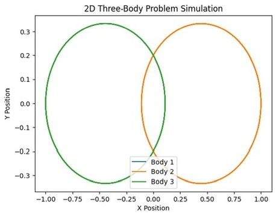
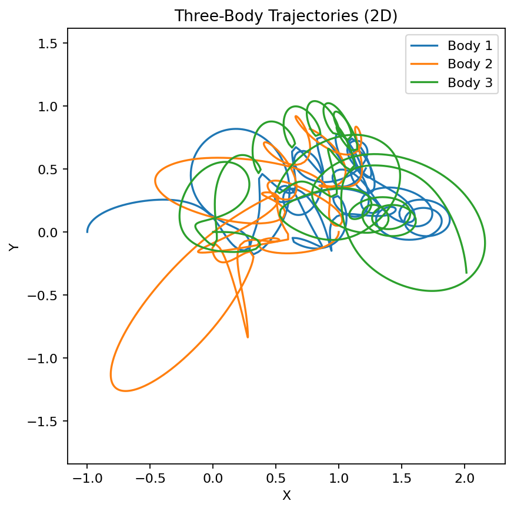
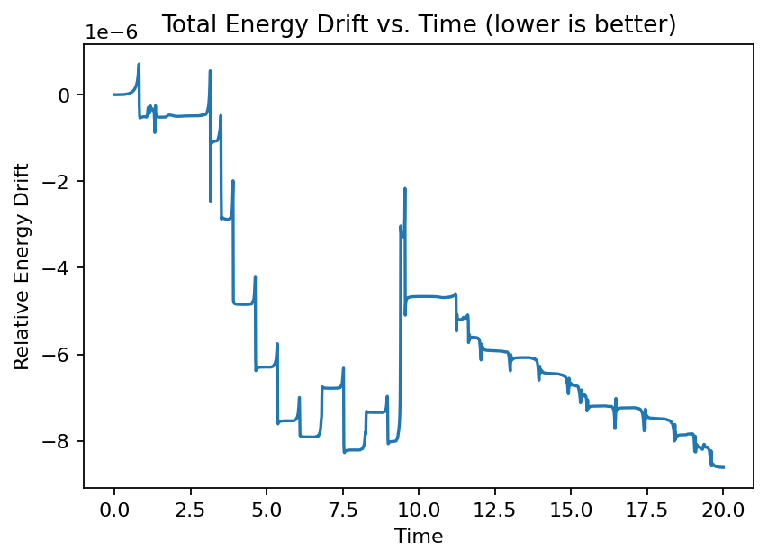

# GROK-Memory
# 2D Three-Body Problem Simulation  
**Author:** jazzin  
**Project:** Qquarts co.

---

## 📌 개요
이 프로젝트는 **2차원 삼체 문제(Three-Body Problem)**를 단순화하여 수치적으로 시뮬레이션한 결과입니다.  
삼체 문제는 **세 개의 질점**이 서로의 중력에 영향을 주며 운동하는 문제로,  
초기 조건에 극도로 민감하고 혼돈적 행동을 보이는 대표적인 난제입니다.

---

## 🧠 실험 목표
- 2D 공간에서 삼체 궤도 시뮬레이션을 구현
- 안정적 궤도 vs 혼돈적 궤도 비교
- 에너지 보존 검증을 통한 계산 신뢰성 확보

---

## ⚙️ 실험 설정
| 항목         | 값            | 설명             |
|-------------|---------------|------------------|
| G           | 1.0           | 중력 상수 |
| m1, m2, m3  | 1.0, 1.0, 1.0 | 세 입자의 질량 |
| t_max       | 10.0          | 시뮬레이션 시간 |
| dt          | 0.01          | 시간 간격 |
| solver      | `scipy.odeint` | 4차 Runge-Kutta |

---

## 🧩 시뮬레이션 결과

### **1. 이상적 초기 조건 — 안정 궤도**


- Body 2와 Body 3가 거의 완벽한 타원 궤도를 유지
- 에너지 손실 최소, 시스템 안정성 확보

---

### **2. 일반 초기 조건 — 혼돈 궤도**


- 세 입자 간 상호작용이 복잡하게 꼬임
- 초기 속도의 미세한 변화만으로 궤도가 전혀 다르게 전개
- 삼체 문제의 혼돈성을 직관적으로 확인 가능

---

### **3. 에너지 드리프트 분석**


- 상대 에너지 변화량 ≈ 10^-6 수준  
- 시뮬레이션 신뢰성 확보

---

## 🔍 해석 및 의의
- 삼체 문제는 **초기 조건 민감성(Sensitive Dependence)**을 명확히 보여줌
- 혼돈계(Chaotic System)의 대표적 예시 → PHAM 시뮬 연구의 기반 데이터로 활용 가능
- 플라라니아(Qquarts 뉴런 시뮬) 및 PHAM 세계관의 "에너지 상호작용 모델"로 연결 가능

---

## 🗂️ 파일 구조
```bash  
├── code/  
│   ├── three_body_2d.py  
│   ├── analyze_last_run.py  
├── data/  
│   ├── planaria_threebody.csv  
├── figures/  
│   ├── stable_orbits.png  
│   ├── chaotic_orbits.png  
│   ├── energy_drift.png  
└── README.md  

